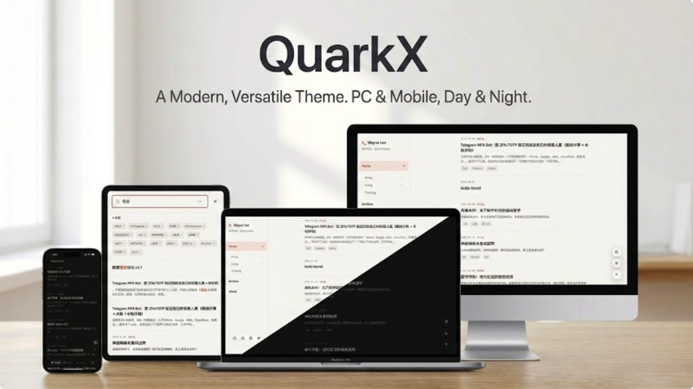
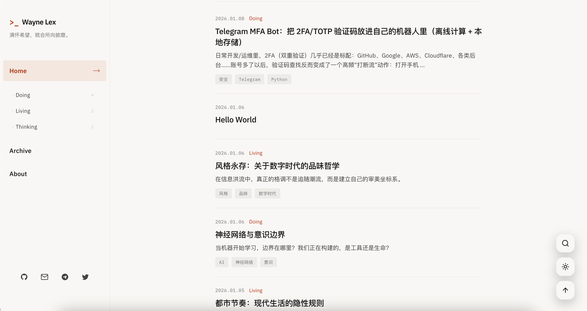
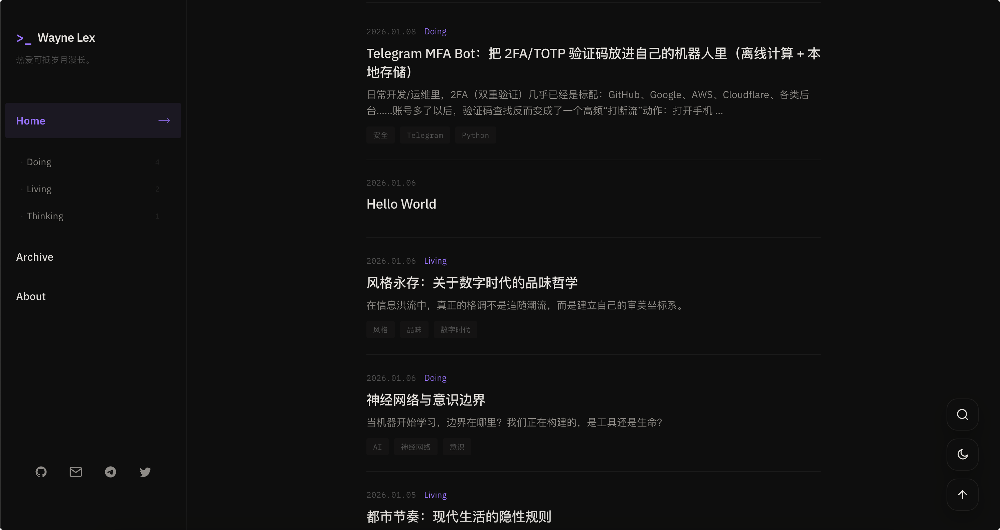
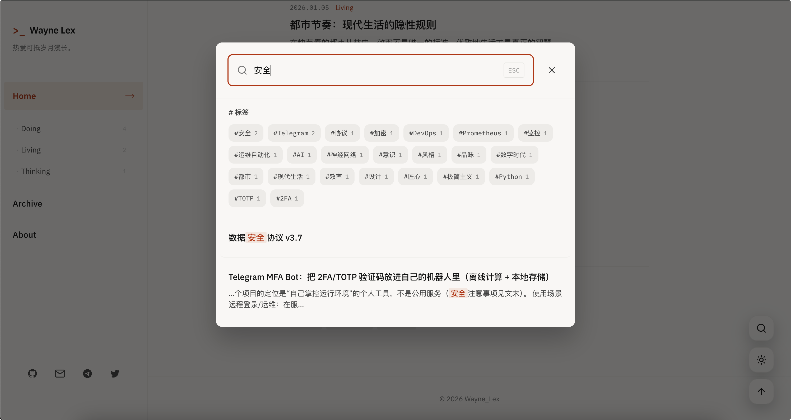
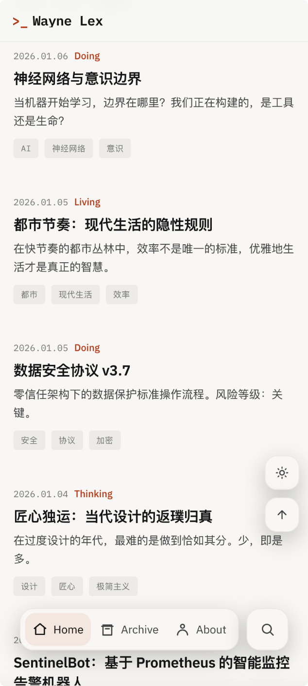
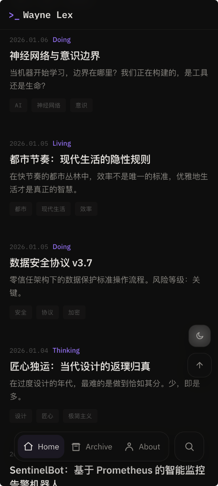
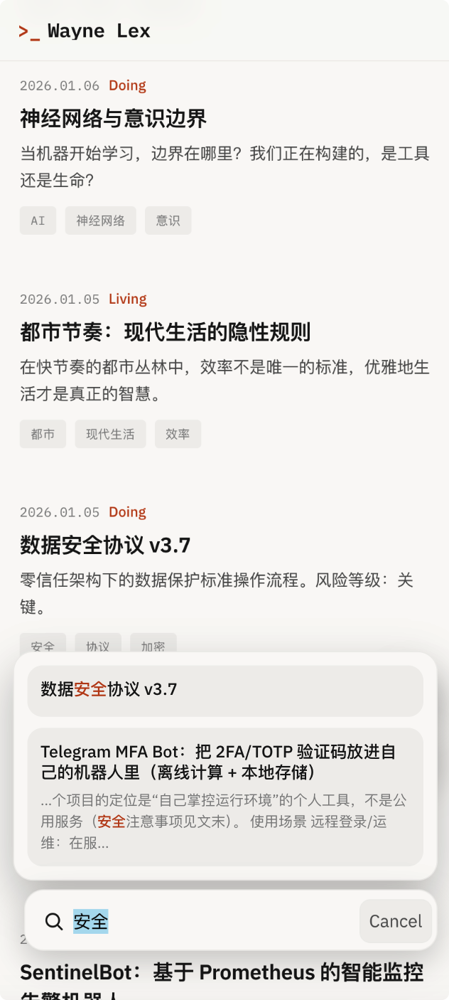

# QuarkX - 极简极客风 Hexo 主题

> 极简·克制·有品位 | Minimal · Restrained · Tasteful

[](LICENSE)
[](https://hexo.io)

一个专为极客打造的极简风格 Hexo 主题，追求**极致的阅读体验**和**优雅的交互细节**。灵感来自现代极简设计，融合 iOS 26 交互理念，在 PC 端和移动端都提供流畅、沉浸的浏览体验。



## ✨ 特性亮点

### 🎨 设计哲学

- **极简克制**：去除一切不必要的装饰，专注内容本身
- **双色主题**：精心调校的浅色/深色模式，护眼且优雅
  - 浅色模式：暖色调背景 `#faf9f7` + 暗橙强调色 `#bf4a1c`
  - 深色模式：深色背景 `#111110` + 亮紫强调色 `#a78bfa`
- **响应式设计**：完美适配 PC 端和移动端，体验无缝切换

### 📱 移动端交互（仿 iOS 26）

- **智能 TabBar**：底部导航栏默认隐藏，跟随滚动智能显示/隐藏
  - 下滑（内容向上滚动）→ 自动显示（阈值 20px，快速响应）
  - 上滑（内容向下滚动）→ 自动隐藏（阈值 -40px，更不灵敏，避免误触）
  - 顶部 30px 内保持隐藏，避免遮挡内容
  - 搜索激活时保持显示，确保交互不被打断

- **搜索按钮形变**：点击搜索按钮后，按钮平滑形变为输入框，结果面板从底部滑出
  - 支持键盘 ESC 关闭
  - 点击外部自动收起
  - 点击结果链接后自动收起

- **浮动操作按钮**：主题切换和返回顶部按钮，跟随滚动显示/隐藏

### 💻 PC 端体验

- **固定侧边栏**：左侧固定导航，包含 Logo、导航菜单、分类筛选、社交链接
  - Home 菜单下自动展开分类二级菜单（Doing/Living/Thinking 等）
  - 分类菜单支持前端过滤，无需刷新页面

- **首页标签展示**：PC 端首页显示标签列表（移动端隐藏，节省空间）

- **分类筛选**：首页顶部提供分类筛选按钮（仅 PC 端显示）
  - 支持按分类筛选文章
  - 筛选后文章列表带动画延迟效果，视觉更流畅

- **全屏搜索弹窗**：
  - 按 `/` 键快速打开（全局快捷键）
  - 支持键盘导航：方向键选择结果，Enter 确认
  - 标签快捷入口：点击标签快速搜索
  - ESC 键关闭
  - 滚动条宽度补偿，避免弹窗时页面抖动

- **浮动操作按钮**：下滑超过 100px 后显示
  - 搜索按钮（打开全屏搜索）
  - 主题切换按钮（日间/夜间模式）
  - 返回顶部按钮

### 🔍 智能搜索

- **双端适配**：
  - PC 端：全屏弹窗，支持键盘导航
  - 移动端：集成在 TabBar，按钮形变交互

- **搜索优化**：
  - 结果缓存机制，提升响应速度
  - 相关性评分排序（标题完全匹配 > 标题开头 > 标题包含 > 内容匹配 > 标签/分类匹配）
  - 支持标题、内容、标签、分类多维度搜索
  - 关键词高亮显示

- **降级策略**：搜索索引加载失败时，自动从 DOM 构建索引

### 🌓 主题切换

- **平滑过渡**：300ms 过渡动画，避免闪烁
- **系统偏好检测**：自动跟随系统深色/浅色模式
- **持久化存储**：用户选择保存在 localStorage
- **Meta 标签同步**：自动更新 `theme-color` meta 标签，适配浏览器 UI

### 🎯 其他细节

- **打字机效果**：首页副标题支持多文本循环打字机动画
  - 可配置多段文本循环播放
  - 每段文本显示完整后停顿 3 秒再删除
  - 移动端自动降低速度，减少重排

- **图片懒加载**：原生 `loading="lazy"` + IntersectionObserver 降级
  - 提前 50px 开始加载，平衡体验和性能

- **Service Worker**：离线支持和资源缓存
  - 网络优先策略（HTML）
  - 缓存优先策略（静态资源）
  - 版本号管理，自动清理旧缓存

- **代码块增强**：移动端滚动指示器，提示可横向滚动

- **表格优化**：移动端横向滚动支持，带滚动指示器

- **滚动性能优化**：移动端滚动时自动禁用动画，提升流畅度

- **首页分类筛选**：PC 端首页顶部显示分类筛选按钮，支持前端过滤

- **标签展示**：PC 端首页显示标签列表，移动端隐藏以节省空间

## 📸 预览

### PC 端

<table>
<tr>
<td width="33.33%">

**浅色模式**



</td>
<td width="33.33%">

**深色模式**



</td>
<td width="33.33%">

**全屏搜索**



</td>
</tr>
</table>

### 移动端

<table>
<tr>
<td width="33.33%">

**浅色模式**



</td>
<td width="33.33%">

**深色模式**



</td>
<td width="33.33%">

**TabBar 搜索**



</td>
</tr>
</table>

## 🚀 快速开始

### 安装

```bash
cd your-hexo-site
git clone https://github.com/your-username/quarkx.git themes/quarkx
```

### 配置

在 Hexo 根目录的 `_config.yml` 中设置主题：

```yaml
theme: quarkx
```

### 主题配置

编辑 `themes/quarkx/_config.yml`：

```yaml
# 菜单
menu:
  Home: /
  Archive: /archives
  About: /about

# Logo 文本
logo: "Your Name"

# 打字机效果文本（首页副标题）
typewriter_texts:
  - "凡是过往，皆为序章"
  - "Focus on the good, and the good gets better."
  - "热爱可抵岁月漫长。"

# 页脚
footer:
  since: 2026
  powered_by: true

# 搜索配置
search:
  enable: true
  placeholder: "搜索关键字..."

# 代码高亮主题
highlight:
  theme: minimal

# 社交链接
social:
  GitHub: https://github.com/yourusername
  Email: mailto:your@email.com
  Telegram: https://t.me/yourusername
  Twitter: https://x.com/yourusername
```

### 启用搜索

安装 `hexo-generator-searchdb` 插件：

```bash
npm install hexo-generator-searchdb --save
```

在 Hexo 根目录的 `_config.yml` 中配置：

```yaml
search:
  path: search.json
  field: all
  content: true
```

## 📖 功能详解

### 移动端 TabBar 滚动逻辑

移动端底部导航栏采用**滚动累积器**机制，实现平滑的显示/隐藏：

- **滚动方向检测**：通过累积滚动距离判断用户意图
- **方向改变重置**：滚动方向改变时重置累积值，避免误判
- **差异化阈值**：
  - 下滑显示：20px（快速响应，提升可用性）
  - 上滑隐藏：-40px（更不灵敏，避免阅读时误触）
- **顶部保护**：页面顶部 30px 内保持隐藏，避免遮挡内容
- **搜索状态保护**：搜索激活时（`is-searching`）保持显示，确保交互不被打断

### PC 端与移动端差异

| 功能 | PC 端 | 移动端 |
|------|-------|--------|
| 导航菜单 | 固定左侧侧边栏 | 底部 TabBar（Home/Archive/About） |
| 分类筛选 | 侧边栏二级菜单 + 首页顶部筛选按钮 | 仅侧边栏二级菜单 |
| 标签展示 | 首页显示标签列表 | 隐藏（节省空间） |
| 搜索入口 | 浮动按钮 → 全屏弹窗 | TabBar 搜索按钮 → 形变输入框 |
| 社交链接 | 侧边栏底部 | 隐藏（空间有限） |
| 浮动按钮 | 右侧（搜索/主题/返回顶部） | 右侧（主题/返回顶部） |

### PC 端搜索弹窗

- **滚动条补偿**：使用 `scrollbar-gutter: stable` 和 CSS 变量补偿，避免弹窗时页面宽度变化导致的抖动
- **键盘快捷键**：
  - `/`：打开搜索（全局，弹窗未打开时）
  - `ESC`：关闭搜索
  - `↑/↓`：导航搜索结果
  - `Enter`：打开选中结果
- **标签快捷入口**：点击标签自动填入搜索框并触发搜索

### 主题切换机制

- **初始化顺序**：
  1. 读取 localStorage 保存的主题
  2. 验证有效性（仅接受 `light`/`dark`）
  3. 无效时读取系统偏好
  4. 应用主题并更新 meta 标签

- **过渡动画**：使用 `theme-transitioning` 类，300ms 后自动移除，确保过渡平滑


## 🎨 自定义

### 修改主题色

编辑 `themes/quarkx/source/css/style.css`：

```css
/* 浅色主题 */
:root,
[data-theme="light"] {
  --accent: #bf4a1c;        /* 强调色 */
  --accent-hover: #a33d15;  /* 悬停色 */
  --accent-bg: rgba(191, 74, 28, 0.08); /* 强调背景 */
}

/* 深色主题 */
[data-theme="dark"] {
  --accent: #a78bfa;        /* 强调色 */
  --accent-hover: #c4b5fd;  /* 悬停色 */
  --accent-bg: rgba(167, 139, 250, 0.12); /* 强调背景 */
}
```

### 修改字体

主题使用 Google Fonts，可在 `themes/quarkx/layout/layout.ejs` 中修改字体链接。

默认字体：
- 无衬线：IBM Plex Sans
- 衬线：Newsreader
- 等宽：IBM Plex Mono

## 📝 更新日志

### v2.0.0
- ✨ 新增移动端 TabBar 智能显示/隐藏
- ✨ 新增搜索按钮形变交互
- ✨ 新增 PC 端全屏搜索弹窗
- ✨ 新增主题切换平滑过渡
- ✨ 优化搜索相关性评分
- 🐛 修复移动端滚动性能问题
- 🐛 修复 Service Worker 缓存问题

## 🤝 贡献

欢迎提交 Issue 和 Pull Request！

## 📄 许可证

MIT License

## 🙏 致谢

- [Hexo](https://hexo.io) - 静态博客框架
- [IBM Plex](https://github.com/IBM/plex) - 字体
- [Newsreader](https://github.com/productiontype/Newsreader) - 字体

---

**Made with ❤️ for geeks**
